# AndiGenerator.NET – Anleitung

AndiGenerator.NET erstellt Spielpläne für Tischtennis-Staffeln. Grundlage sind die Terminwünsche, die die Vereine in click-TT gemeldet haben. Das Programm sucht so lange nach besseren Plänen, bis Sie zufrieden sind, und exportiert das Ergebnis als CSV-Datei für den Import in click-TT.

AndiGenerator.NET ist die Weiterentwicklung des **AndiGenerators** von Andreas Hofmann. Die Optimierung, die Bewertung der Pläne und die Dateiformate stammen aus seinem Programm und rechnen genauso. Neu sind die Oberfläche und die Bedienung. Diese Anleitung beschreibt die neue Oberfläche; die fachlichen Kapitel folgen inhaltlich der Anleitung des Originals.

**Inhalt**

1. [Allgemeines](#1-allgemeines)
2. [Installation](#2-installation)
3. [Erste Schritte](#3-erste-schritte)
4. [Das Hauptfenster](#4-das-hauptfenster)
5. [Die Generierung steuern](#5-die-generierung-steuern) – mit [Der Automodus](#51-der-automodus)
6. [Pläne beurteilen: die Ansichten](#6-pläne-beurteilen-die-ansichten)
7. [Gewichtungen anpassen](#7-gewichtungen-anpassen)
8. [Pläne merken und vergleichen](#8-pläne-merken-und-vergleichen)
9. [Export und Druck](#9-export-und-druck)
10. [Spielplandaten bearbeiten](#10-spielplandaten-bearbeiten)
11. [Runden: Doppelrunde, Halbrunde, Vor- und Rückrunde einzeln](#11-runden)
12. [Bewertung der Pläne (Kosten)](#12-bewertung-der-pläne-kosten)
13. [Tipps und häufige Fragen](#13-tipps-und-häufige-fragen)

---

## 1. Allgemeines

AndiGenerator.NET ist Freie Software: Sie können es unter den Bedingungen der GNU General Public License Version 3 weitergeben und verändern. Das Programm wird in der Hoffnung bereitgestellt, dass es nützlich ist, aber **ohne jede Gewährleistung**, auch ohne die stillschweigende Gewährleistung der Marktreife oder der Eignung für einen bestimmten Zweck. Den Lizenztext finden Sie unter <https://www.gnu.org/licenses/gpl-3.0.html> und im Dialog **Über**.

**Wo das Programm seine Daten ablegt**

| Was | Wo |
|---|---|
| Die click-TT-Datei (XML) | dort, wo Sie sie gespeichert haben |
| Ihre Änderungen an den Spielplandaten | als Datei mit der Endung `.modifications` neben der XML-Datei |
| Einstellungen und gemerkte Pläne je Staffel | im Ordner `%LOCALAPPDATA%\AndiGenerator.NET` |

Wenn Sie vorher mit dem Original-AndiGenerator gearbeitet haben, übernimmt AndiGenerator.NET beim ersten Öffnen einer Staffel deren Einstellungen und gemerkte Pläne als **Kopie**. Die Dateien des Originals werden nicht verändert; Sie können beide Programme nebeneinander verwenden. Eine vorhandene `.modifications`-Datei wird von beiden Programmen gelesen.

## 2. Installation

AndiGenerator.NET läuft unter Windows 10 und 11 (64 Bit), auf Chromebooks und unter Linux (siehe unten). Administratorrechte sind nicht nötig, und .NET muss nicht installiert sein – alles Nötige ist dabei.

**Mit Setup (empfohlen)**

1. Auf der Seite [Releases](https://github.com/PBuchmann/AndiGenerator.NET/releases) bei der neuesten Version die Datei `AndiGeneratorNET-win-Setup.exe` herunterladen.
2. Die Datei starten. Das Programm wird für Ihr Benutzerkonto installiert (im Ordner `%LOCALAPPDATA%\AndiGeneratorNET`), erscheint im Startmenü und auf dem Desktop und startet gleich.

**Ohne Installation**

Stattdessen `AndiGeneratorNET-win-Portable.zip` herunterladen, in einen beliebigen Ordner entpacken und dort `AndiGenerator.NET.exe` starten. Diese Variante eignet sich z. B. für einen USB-Stick.

**Warnung von Windows beim ersten Start**

Solange das Programm noch nicht digital signiert ist, warnt Windows beim ersten Start („Der Computer wurde durch Windows geschützt“). Klicken Sie auf **Weitere Informationen** und dann auf **Trotzdem ausführen**. Ist bei Ihnen die *Intelligente App-Steuerung* von Windows 11 eingeschaltet, lässt sich das Programm bis zur Signierung nicht starten.

**Updates**

Das installierte Programm sucht nach dem Start selbst nach einer neuen Version und lädt sie im Hintergrund. Danach fragt es, ob es gleich neu starten soll; andernfalls wird die neue Version beim nächsten Beenden eingespielt. Ihre Einstellungen, gemerkten Pläne und Staffeldateien bleiben dabei erhalten. Dabei fragt das Programm nur GitHub nach der neuesten Version; Daten aus Ihren Staffeln werden nicht übertragen. Wer das nicht möchte, schaltet im Dialog **Über** die Einstellung **Beim Start nach neuen Versionen suchen** ab.

**Deinstallieren**

Über *Einstellungen → Apps → Installierte Apps → AndiGenerator.NET → Deinstallieren*. Ihre Daten im Ordner `%LOCALAPPDATA%\AndiGenerator.NET` und Ihre click-TT-Dateien bleiben erhalten.

**Auf einem Chromebook (und unter Linux)**

Auf Chromebooks läuft das Programm in der Linux-Entwicklungsumgebung, die ChromeOS mitbringt.

1. Einmalig Linux einschalten: *Einstellungen → Info zu ChromeOS → Entwickler → Linux-Entwicklungsumgebung → Aktivieren* (bei älteren Versionen *Einstellungen → Erweitert → Entwickler*).
2. Auf der Seite [Releases](https://github.com/PBuchmann/AndiGenerator.NET/releases) das passende Paket herunterladen: `andigenerator-net_<Version>_amd64.deb` für Chromebooks mit Intel- oder AMD-Prozessor, `…_arm64.deb` für Chromebooks mit ARM-Prozessor (z. B. MediaTek oder Qualcomm). Welcher Prozessor eingebaut ist, steht unter *Einstellungen → Info zu ChromeOS → Weitere Details*, oder im Linux-Terminal mit `dpkg --print-architecture`.
3. In der App *Dateien* doppelt auf die heruntergeladene Datei klicken und **Installieren** wählen. Das Programm erscheint danach im Launcher im Ordner *Linux-Apps*.
4. Die click-TT-Dateien müssen für Linux sichtbar sein: entweder in den Ordner *Linux-Dateien* legen oder einen Ordner in *Dateien* mit der rechten Maustaste **Mit Linux teilen**.

Ohne Installation geht es mit `AndiGeneratorNET-<Version>-linux-x64.tar.gz` bzw. `…-linux-arm64.tar.gz`: entpacken und `./AndiGenerator.NET` starten. Unter Linux liegen die eigenen Daten im Ordner `~/.local/share/AndiGenerator.NET`. Neue Versionen werden hier nicht selbst gesucht – zum Aktualisieren das neue Paket genauso installieren.

## 3. Erste Schritte

Der Weg zu einem fertigen Plan in sechs Schritten:

### 3.1 Terminwünsche aus click-TT herunterladen

Das Programm braucht die Terminmeldungen der Staffel. click-TT stellt sie als XML-Datei bereit, die ursprünglich für den Meinl-Generator gedacht war:

1. In click-TT als Staffelleiter anmelden.
2. **Spielbetrieb Organisation** öffnen und die Staffel wählen.
3. Oben rechts bei den Downloads **Terminmeldung für Meinl-Generator (xml)** anklicken und die Datei speichern.

Die Datei enthält die Terminwünsche aller Mannschaften und die schon terminierten Spiele der Nachbarmannschaften aus anderen Staffeln.

> **Tipp:** Laden Sie die XML-Datei immer unter demselben Namen in denselben Ordner. Dann bleiben Ihre Änderungen (`.modifications`) erhalten, auch wenn Sie die Datei später neu herunterladen, weil sich in click-TT etwas geändert hat.

### 3.2 Staffel öffnen

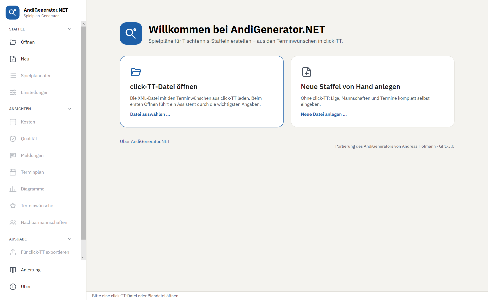

Auf der Startseite **click-TT-Datei öffnen** wählen, oder links **Öffnen**. Zuletzt geöffnete Staffeln stehen in der Liste darunter und öffnen sich mit einem Klick; mit dem **×** am Ende einer Zeile entfernen Sie einen Eintrag aus der Liste (die Datei selbst bleibt erhalten).

Ohne click-TT können Sie mit **Neu** eine leere Plandatei anlegen und Liga, Mannschaften und Termine von Hand eingeben. Die Eingabemasken sind dafür aber eher zum Korrigieren gedacht als zum Erfassen einer ganzen Staffel.

### 3.3 Die Staffel einrichten

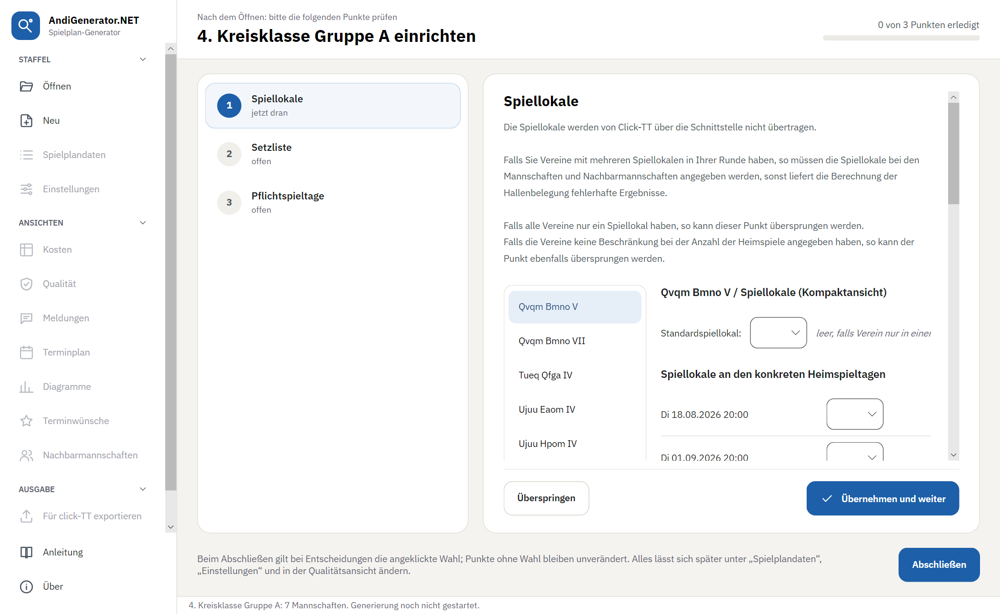

click-TT überträgt nicht alles, was für einen guten Plan nötig ist, und die Meldungen der Vereine enthalten gelegentlich Fehler. Nach dem Öffnen zeigt das Programm deshalb eine Seite mit den Punkten, die Sie prüfen sollten. Welche Punkte erscheinen, hängt von der Staffel ab:

| Punkt | Worum es geht |
|---|---|
| **Gespeicherte Einstellungen** | Sie haben die Staffel schon einmal bearbeitet und dabei Gewichtungen geändert. Wählen Sie, ob Sie diese weiterverwenden oder für diese Sitzung mit den Standardeinstellungen rechnen wollen (die gespeicherten bleiben erhalten). |
| **Gespeicherte Kriterienreihenfolge** | Sie haben für diese Staffel in der Ansicht **Qualität** eine eigene Einteilung der Kriterien in die Stufen A, B und C festgelegt (danach richtet sich der Automodus). Die Seite zeigt sie; wählen Sie, ob Sie sie weiterverwenden oder für diese Sitzung die Standardreihenfolge nehmen (die gespeicherte bleibt erhalten, bis Sie die Einteilung wieder ändern). |
| **Rundenplanung** | Ist die Runde kürzer als sechs Monate, schlägt das Programm eine Halbrunde vor. Liegt die Vorrunde schon in der Vergangenheit, schlägt es vor, nur die Rückrunde zu planen. |
| **Spiellokale** | click-TT überträgt keine Spiellokale. Haben Vereine mehrere Hallen, tragen Sie hier ein, welche Mannschaft wo spielt – sonst stimmt die Berechnung der Hallenbelegung nicht. Haben alle Vereine nur eine Halle, können Sie den Punkt überspringen. |
| **Koppeltermine** | Die Staffel enthält Koppelwünsche oder mögliche Doppelspieltage. Das Programm leitet sie aus den Meldungen ab; bitte kontrollieren. |
| **Auswärtskoppelwünsche** | Mannschaften möchten zwei Auswärtsspiele an einem Wochenende zusammenlegen. Bitte kontrollieren. |
| **Setzliste** | Wenn Sie mit einer Setzliste arbeiten wollen, geben Sie hier die erwartete Abschlusstabelle vor. |
| **Pflichtspieltage** | Die Staffel enthält Pflichtspieltage. Sie sind bei ungerader Mannschaftszahl problematisch (siehe [Pflichtspieltage](#pflichtspieltage)). |

Jeder Punkt lässt sich direkt auf der Seite bearbeiten; mit **Auswahl übernehmen** ist er erledigt, mit **Überspringen** bleibt er, wie er ist. Unten beendet **Abschließen** die Einrichtung; die Generierung startet danach im Hauptfenster mit **Kostenoptimierung starten** bzw. **Automodus starten**, wo auch der Ausgangsplan gewählt wird. Bei Entscheidungen gilt dabei die angeklickte Wahl, auch ohne **Auswahl übernehmen**; Punkte, bei denen Sie nichts gewählt haben, bleiben unverändert. Die Wahlkacheln und Knöpfe stehen immer unten im Blick, auch wenn die Erklärung darüber lang ist. Alles lässt sich später unter **Spielplandaten**, **Einstellungen** und in der Ansicht **Qualität** ändern.

### 3.4 Terminwünsche kontrollieren

Bevor Sie die Generierung starten, lohnt ein Blick in die Ansicht **Terminwünsche** (links unter *Ansichten*). Sie zeigt, was die Vereine gemeldet haben, und markiert Probleme – zum Beispiel eine Mannschaft, die zu wenige Heimtermine gemeldet hat. Ein Plan lässt sich trotzdem erzeugen; es bleiben dann aber Spiele ohne Termin. Einzelheiten in Abschnitt [6.6](#66-terminwünsche).

### 3.5 Generierung starten und beobachten

Mit dem blauen Startknopf oben rechts beginnt die Suche. Über den Pfeil rechts daneben wählen Sie das Verfahren:

- **Kostenoptimierung** – wie im Original: Die Suche senkt die Gesamtkosten mit Ihren Gewichtungen.
- **Automodus** – die Suche lenkt sich selbst über die Gewichte, so wie man es von Hand an den Reglern tun würde: Erst drängt sie die Verstöße der Stufen A und B heraus (Hallenbelegung, parallele Spiele, Pflichtspieltage, Koppel-, Sperr- und Ausweichtermine), dann glättet sie die übrigen Kriterien, ohne A und B wieder zu verschlechtern. Wie er arbeitet und wann er sich lohnt, steht in Abschnitt [5.1](#51-der-automodus).

Beim Start des Automodus (und beim Wechsel zu ihm) springt das Programm in die Ansicht **Qualität**, beim Start der Kostenoptimierung (und beim Wechsel zu ihr) in die Ansicht **Kosten**; fehlt die Ansicht, wird sie geöffnet.

Der Knopf merkt sich die Wahl und heißt danach **Kostenoptimierung starten** bzw. **Automodus starten**. Auch während der Generierung – laufend oder pausiert – lässt sich über den Pfeil zum anderen Verfahren wechseln; die Suche setzt beim bisher besten Plan fort.

Das Programm rechnet mit allen Prozessorkernen bis auf einen, damit der Rechner bedienbar bleibt, und zeigt laufend den besten bisher gefundenen Plan.

Schon nach wenigen Sekunden steht ein erster Plan. Nach einigen hunderttausend berechneten Plänen ist meist etwas Brauchbares dabei; nach einigen Millionen findet das Programm oft nur noch kleine Verbesserungen. Wie schnell das geht, hängt stark vom Prozessor ab – die Anzeige **Berechnete Pläne** nennt die aktuelle Geschwindigkeit.

### 3.6 Plan beurteilen, nachsteuern und exportieren

Während die Generierung läuft, beurteilen Sie den Plan in den Ansichten **Kosten**, **Qualität** und **Diagramme** und steuern über die Gewichtungen nach (Abschnitt [7](#7-gewichtungen-anpassen)). Die Generierung muss dafür nicht angehalten werden.

Passt der Plan, **pausieren** Sie und exportieren ihn mit **Für click-TT exportieren** als CSV-Datei (Abschnitt [9](#9-export-und-druck)). Die CSV-Datei importieren Sie in click-TT als Spielplan.

## 4. Das Hauptfenster

**Links** stehen alle Befehle:

- **Staffel:** Öffnen, Neu, Spielplandaten, Einstellungen
- **Ansichten:** Kosten, Qualität, Meldungen, Terminplan, Diagramme, Terminwünsche, Nachbarmannschaften
- **Ausgabe:** Für click-TT exportieren (farblich hervorgehoben), Drucken (PDF)
- **Anleitung:** öffnet diese Anleitung als PDF
- **Über:** Version, Urheber und Lizenzen

Die Abschnitte *Staffel*, *Ansichten* und *Ausgabe* lassen sich mit einem Klick auf ihre Überschrift zu- und wieder aufklappen; so bleibt die Leiste auch auf kleinen Bildschirmen übersichtlich.

**Oben** stehen der Name der Staffel, die Datei und die Steuerung der Generierung: **Start mit**, **Plan merken**, **Kostenoptimierung starten / Automodus starten / Pausieren / Fortsetzen** (mit dem Pfeil zur Wahl des Verfahrens), **Beenden** und **Schließen**. *Schließen* führt zur Startseite zurück; läuft noch eine Generierung, fragt das Programm vorher nach. Wählen Sie unter **Start mit** einen vorhandenen Plan (gemerkt oder aus click-TT), zeigen alle Ansichten und die Kacheln sofort diesen Plan – mit Kosten und Qualität –, ohne dass eine Optimierung startet und ihn verändert.

Darunter vier **Kacheln** mit dem Stand der Generierung:

| Kachel | Bedeutung |
|---|---|
| **Gesamtkosten (bester Plan)** | Die Kosten des besten bisher gefundenen Plans; darunter, wie stark sie seit Beginn gesunken sind. Nach einer Änderung der Gewichtung gilt der Vergleich ab dieser Änderung, weil die Kosten davor anders berechnet wurden. **Details ›** öffnet die Kostenansicht. |
| **Pflichtregeln (Stufe A)** | Ob der beste Plan die wichtigsten Regeln einhält (siehe [Qualität](#62-qualität)). **Details ›** öffnet die Qualitätsansicht. |
| **Verbesserungen** | Wie oft ein besserer Plan gefunden wurde, und wann zuletzt. |
| **Berechnete Pläne** | Anzahl der geprüften Pläne und die aktuelle Geschwindigkeit. |

Im Automodus entfällt die Kachel *Pflichtregeln*; die Ergebniskachel nimmt ihren Platz mit ein, *Verbesserungen* und *Berechnete Pläne* bleiben an ihrer Stelle. Die breitere Ergebniskachel zeigt oben die Phase (z. B. „Automodus · Optimierung Stufe A“) und unten unter **In Arbeit** alle Kriterien, an denen gerade gearbeitet wird (in Stufe A und B die zuletzt angehobenen, in C das, das geglättet wird) und vor jeder Verstoßzahl klein den Stand am Ende der Basisoptimierung (z. B. „A 14 → 3“).

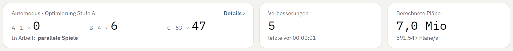

Den **Hauptbereich** füllen die Ansichten. Jede Ansicht öffnet sich als Reiter; Sie können mehrere öffnen, zwischen ihnen wechseln, sie per Maus nebeneinander anordnen und mit dem **×** am Reiter schließen. In vielen Ansichten vergrößert oder verkleinert **Strg + Mausrad** (oder der Zoomregler) die Darstellung.

Ganz unten zeigt die **Statuszeile** den Stand in einer Zeile.

## 5. Die Generierung steuern

| Schaltfläche | Wirkung |
|---|---|
| **Kostenoptimierung starten** / **Automodus starten** | Beginnt die Suche mit dem Ausgangsplan aus **Start mit** und dem gewählten Verfahren. |
| **Pfeil neben dem Startknopf** | Wählt das Verfahren; während der Generierung wechselt er zum anderen Verfahren, ab dem bisher besten Plan. |
| **Pausieren** | Hält die Suche an. Der beste Plan bleibt erhalten; so können Sie ihn in Ruhe ansehen oder exportieren. |
| **Fortsetzen** | Setzt eine pausierte Suche mit ihrem besten Plan fort. |
| **Beenden** | Beendet die Generierung. Danach kann mit einem anderen Ausgangsplan neu gestartet werden. |

**Start mit** legt fest, wovon die nächste Generierung ausgeht:

- **leerem Plan** – das Programm plant von Grund auf neu (Standard);
- **bestem Plan der letzten Generierung** – nach *Beenden* dort weitermachen;
- **in click-TT vorhandenem Plan** – ein schon in click-TT eingetragener Plan wird verbessert;
- **gemerktem Plan „…“** – ein früher gemerkter Plan (Abschnitt [8](#8-pläne-merken-und-vergleichen)).

Solange eine Generierung läuft oder pausiert ist, ist *Start mit* gesperrt: Eine laufende Generierung setzt immer ihren eigenen besten Plan fort. Für einen anderen Ausgangsplan zuerst **Beenden**.

Änderungen an den **Einstellungen** und **Spielplandaten** übernimmt eine laufende Generierung sofort; sie rechnet vom bisher besten Plan aus weiter.

### 5.1 Der Automodus

Bei der **Kostenoptimierung** sucht das Programm den Plan mit den niedrigsten Gesamtkosten; was dabei wie viel zählt, bestimmen Sie über die Gewichtungen (Abschnitt [7](#7-gewichtungen-anpassen)). Oft dreht man dann von Hand nach: Ein Kriterium hat noch Verstöße, also Gewicht hoch, abwarten, nächstes Kriterium. Genau das übernimmt der **Automodus**. Er verändert die Gewichte selbst und richtet sich dabei nach der Einteilung der Kriterien in die Stufen A, B und C, die Sie in der Ansicht **Qualität** festlegen (Abschnitt [6.2](#62-qualität)). Ihre eigenen Gewichtungen bleiben dabei unverändert.

Der Automodus arbeitet in **Phasen**; die laufende steht oben in der Ergebniskachel:

1. **Basisoptimierung** – eine gewöhnliche Kostenoptimierung mit Ihren Gewichtungen, bis sie etwa 10 Sekunden lang nichts mehr verbessert. Ihr bester Plan ist der Maßstab für alles Weitere (in der Kachel die kleine Zahl vor dem Pfeil, z. B. „A 14 → 3“).
2. **Optimierung Stufe A** – der Automodus beobachtet die Verstöße der Stufe A. Ändern sie sich 10 Sekunden lang nicht mehr, hebt er das Gewicht genau der Mannschaften und Kriterien um eine Stufe an, die noch Verstöße haben. Das wiederholt er, bis keine Verstöße mehr übrig sind, nichts mehr anzuheben ist oder es dreimal hintereinander nicht besser wird.
3. **Optimierung Stufe B** – ebenso für die Stufe B; die Gewichte der Stufe A bleiben dabei stehen.
4. **Optimierung Stufe C** – nun glättet er die übrigen Kriterien der Reihe nach, wie sie in der Einteilung stehen, ausgehend vom besten Plan. Zuerst nimmt er sich Ausreißer vor: Mannschaften, die bei einem Kriterium mehr als zwei Verstöße mehr haben als nach der Basisoptimierung – ein, zwei mehr sind in Ordnung, viele bei einer Mannschaft wären unfair. Steigen dabei die Verstöße in A oder B wieder, nimmt er die letzte Anhebung zurück und macht beim nächsten Kriterium weiter. Sind alle Kriterien der Stufe C durch, beginnt er wieder mit dem Herausdrängen.

Der Automodus hat keine Zeitgrenze; er läuft, bis Sie **Pausieren** oder **Beenden**. Unter **In Arbeit** zeigt die Ergebniskachel, an welchen Kriterien er gerade arbeitet (Abschnitt [4](#4-das-hauptfenster)).

**Welcher Plan ist der beste?** Der Automodus vergleicht Pläne nicht nach den Gesamtkosten, sondern der Reihe nach: harte Fehler, Verstöße der Stufe A, Verstöße der Stufe B, Ausreißer in C, Verstöße in C und erst zuletzt die Kosten mit Ihren Gewichtungen. Ein Plan mit weniger Verstößen in A gewinnt also immer, auch wenn er teurer ist.

**Eingreifen während der Generierung:**

- **Einteilung ändern** – verschieben Sie in der Ansicht **Qualität** ein Kriterium, gilt das sofort, ohne neue Basisoptimierung. Rückt etwa ein Kriterium von B1 nach A2, drängt der Automodus zuerst genau dieses Kriterium heraus und danach wieder die ganze Stufe A.
- **Verfahren wechseln** – über den Pfeil am Startknopf, auch in der Pause. Beim Wechsel von der Kostenoptimierung in den Automodus entfällt die Basisoptimierung: Der bisher beste Plan ist schon optimiert und gilt als Basis, der Automodus beginnt sofort mit Stufe A. Ein bewährter Weg ist deshalb, mit der Kostenoptimierung zu beginnen und, wenn sie kaum noch Fortschritte macht, in den Automodus zu wechseln.

**Wann welches Verfahren?** Der Automodus lohnt sich, wenn Pflichtregeln und Terminwünsche der Vereine Vorrang haben und Sie nicht selbst an den Gewichten drehen wollen. Die Kostenoptimierung ist die richtige Wahl, wenn Sie die Gewichtungen gezielt einsetzen oder Ergebnisse mit dem alten AndiGenerator vergleichen wollen – sie rechnet wie das Original.

## 6. Pläne beurteilen: die Ansichten

Die Ansichten **Kosten, Qualität, Meldungen, Terminplan** und **Diagramme** zeigen einen Plan. Welchen, wählen Sie oben in der Ansicht unter **Plan**: den besten Plan der laufenden Generierung, den in click-TT vorhandenen Plan oder einen gemerkten Plan. So lassen sich Pläne nebeneinander vergleichen – etwa zwei Kostenansichten mit verschiedenen Plänen.

Die Ansichten **Terminwünsche** und **Nachbarmannschaften** hängen nicht vom Plan ab, sondern nur von den Daten der Staffel.

In der Regel reichen Kosten, Qualität und Diagramme, um einen Plan zu beurteilen. Die einzelnen Termine müssen Sie meist nicht durchsehen.

### 6.1 Kosten

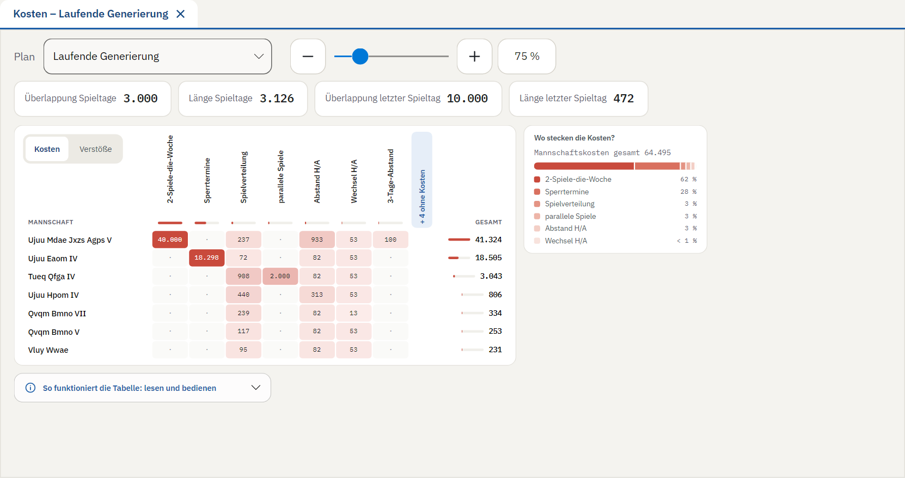

Die Kostenansicht ist das wichtigste Werkzeug während der Generierung. Das Programm bewertet jeden Plan mit **Kosten** (Strafpunkten): Jeder verletzte Wunsch, jede ungünstige Konstellation kostet etwas. Gesucht wird der Plan mit den geringsten Gesamtkosten. Was die einzelnen Kostenarten bedeuten, steht in Abschnitt [12](#12-bewertung-der-pläne-kosten).

- **Kennzahlen:** Unter der Leiste stehen die Kosten, die den ganzen Plan betreffen (Überlappung und Länge der Spieltage, Überlappung und Länge des letzten Spieltags, vereinsinterne Spiele am Anfang). Die Gesamtkosten erscheinen hier nur, wenn Sie einen anderen Plan als die laufende Generierung gewählt haben – die laufende steht ja schon oben in der Kachel.
- **Kostenmatrix:** Zeilen sind die Mannschaften, Spalten die Kostenarten. Beide sind nach Kosten sortiert; die teuersten stehen links oben. Je röter eine Zelle, desto größer ihr Anteil an den Gesamtkosten – dort lohnt es sich zuerst hinzuschauen. Rechts steht die Summe je Mannschaft.
- **Kosten / Verstöße:** Der Umschalter links oben in der Matrix wechselt zwischen den Kostenpunkten und der Zahl der Verstöße. `2/178` heißt: 2 von 178 möglichen Fällen verletzt, zum Beispiel 2 der 178 gemeldeten Sperrtermine belegt. `·` heißt eingehalten; `–` heißt, diese Kostenart zählt keine Verstöße, nur Kostenpunkte (zum Beispiel die Spielverteilung). T steht für Tausend, Mio für Millionen.
- **Leere Kostenarten:** Kostenarten ohne Kosten sind ausgeblendet. Die schmale blaue Spalte **+ n ohne Kosten** blendet sie ein (als schmale graue Spalten) und wieder aus.
- **Wo stecken die Kosten?** Die Karte neben der Matrix zeigt den Anteil jeder Kostenart an den Mannschaftskosten als Balken und Liste.
- **Marken:** Blaue Marken wie **+1** bis **+3** (wichtiger), **−1**, **−2** (weniger wichtig) oder **X** (nicht berücksichtigt) zeigen eine geänderte Gewichtung. Ein blauer Punkt in einer Zelle bedeutet, dass genau diese Zelle eine eigene Gewichtung hat.

**Klicken zeigt Details:** Ein Klick auf eine Zelle, eine Kostenart (Spaltenkopf), eine Mannschaft (Name) oder eine Kennzahl öffnet rechts ein Detailfeld. Es zeigt Verstöße, Kosten und Anteil, die Meldungen dazu (was genau verletzt ist) und die **Gewichtung**, die Sie dort direkt ändern können (Abschnitt [7](#7-gewichtungen-anpassen)). Mit **×** schließen Sie das Detailfeld wieder.

Die aufklappbare Hilfe **So funktioniert die Tabelle** unter der Matrix fasst das alles kurz zusammen.

### 6.2 Qualität

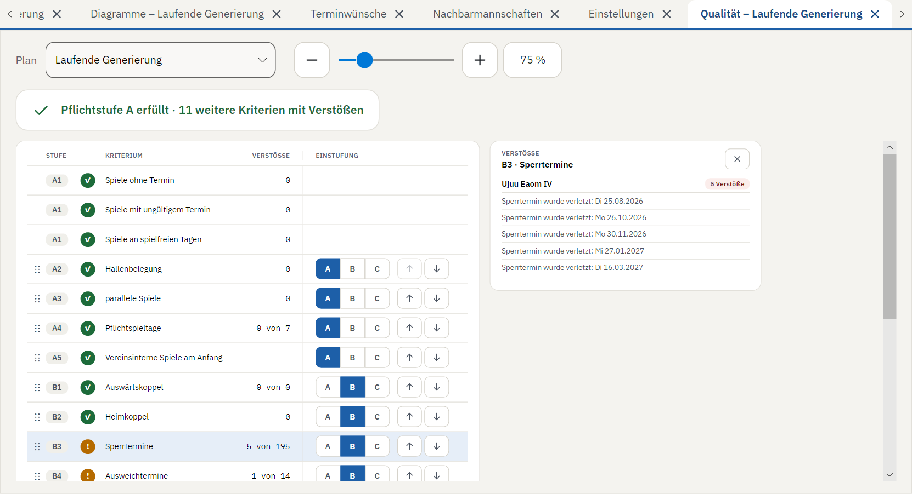

Die Kosten sagen, wie gut ein Plan *insgesamt* ist. Die Qualitätsansicht beantwortet eine andere Frage: **Welche Regeln verletzt der Plan, und wie oft?** Die Kriterien sind nach Wichtigkeit in drei Stufen geordnet. Voreingestellt ist:

| Stufe | Kriterien | Ziel |
|---|---|---|
| **A – Pflicht** | A1 alle Spiele terminiert, gültig und nicht an spielfreien Tagen · A2 Hallenbelegung · A3 parallele Spiele · A4 Pflichtspieltage · A5 vereinsinterne Spiele am Anfang | einhalten |
| **B – Wünsche** | B1 Auswärtskoppel · B2 Heimkoppel · B3 Sperrtermine · B4 Ausweichtermine | möglichst wenige Verstöße; bei sehr vielen gemeldeten Sperrterminen ist ein Rest vertretbar |
| **C – Güte** | alle übrigen Kostenarten, z. B. Heim/Auswärts ausgeglichen, Wechsel Heim/Auswärts, 3-Tage-Abstand, zuletzt die Spieltage | so gut wie möglich |

**Verstöße im Einzelnen:** Ein Klick auf eine Zeile zeigt rechts daneben, wo das Kriterium verletzt ist – je Mannschaft, die meisten Verstöße zuerst, mit den Meldungen wie in der Ansicht **Meldungen** (bei A1 die harten Fehler des ganzen Plans). Ein zweiter Klick auf die Zeile oder **×** schließt die Liste. Hat das Kriterium keine Verstöße, bleibt sie zu; die Liste folgt dem Plan, auch während die Generierung läuft. Länge und Überlappung der Spieltage und vereinsinterne Spiele haben keine Einzelangaben.

**Die Einteilung bestimmen Sie selbst (im Automodus):** Rechts in jeder Zeile wählen Sie die Stufe **A**, **B** oder **C** und verschieben das Kriterium mit den Pfeilen nach oben (wichtiger) oder unten. Rückt ein Kriterium in eine weniger wichtige Stufe (A → B, B → C), steht es dort an erster Stelle; rückt es in eine wichtigere (C → B, B → A), kommt es ans Ende. Am Rand einer Stufe führen die Pfeile in die Nachbarstufe. Oder Sie ziehen die Zeile am Griff **⋮⋮** links an die gewünschte Stelle: Die Zeile hängt dann am Mauszeiger, und die Tabelle macht dort Platz, wo sie landen würde, und nummeriert schon um – Stufe und Nummer ergeben sich aus der Stelle. **Esc** bricht das Ziehen ab. Bei der Kostenoptimierung ist die Einteilung nur zu sehen, nicht zu ändern. Die Nummern folgen der Reihenfolge. Nur A1 (harte Fehler) ist fest, und Länge und Überlappung der Spieltage bleiben in C, weil sie keine Anzahl von Verstößen haben. Die Einteilung wird mit den Spielplandaten gespeichert (bei click-TT-Dateien in der `.modifications`; der alte AndiGenerator lädt die Datei weiterhin und lässt die Angabe unbeachtet). Der **Automodus** richtet sich nach dieser Einteilung: Er drängt erst die Verstöße der Stufe A, dann B heraus und glättet C in der gewählten Reihenfolge. Eine Änderung während der Generierung gilt sofort, ohne neue Basisoptimierung: Der Automodus behält seine Gewichte und macht sofort beim wichtigsten geänderten Kriterium weiter – schieben Sie etwa B1 nach A2, drängt er zuerst genau dieses Kriterium heraus (solange es dort noch vorangeht), danach wieder die ganze Stufe A; bei einer Änderung in C glättet er ab diesem Kriterium. Liegt die Änderung hinter der Stelle, an der er gerade arbeitet, macht er dort einfach weiter.

Die Spalte **Kosten** erscheint nur bei der Kostenoptimierung. Rot markiert sind verletzte Pflichten der Stufe A. Die Kachel **Pflichtregeln (Stufe A)** im Kopf zeigt denselben Stand für die laufende Generierung.

### 6.3 Meldungen

Die Meldungen nennen für jede Mannschaft im Klartext, was im Plan nicht passt – zum Beispiel welcher Sperrtermin belegt ist oder zwischen welchen Spielen weniger als drei Tage liegen. Jede Mannschaft hat eine eigene Karte; die Zahl oben rechts nennt die Anzahl ihrer Meldungen. Die Texte lassen sich markieren und kopieren, etwa für eine Rückfrage beim Verein.

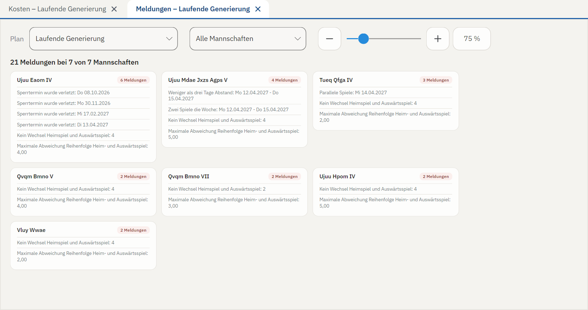

### 6.4 Terminplan

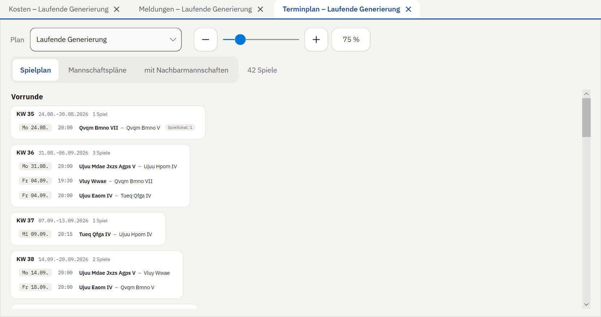

Der Terminplan zeigt die Spiele in drei Darstellungen (Umschalter oben):

- **Spielplan** – alle Spiele nach Kalenderwochen;
- **Mannschaftspläne** – je Mannschaft ihre Spiele, mit der Heim/Auswärts-Folge als Punkten (gefüllt = Heimspiel, hohl = Auswärtsspiel);
- **mit Nachbarmannschaften** – die Mannschaftspläne zusätzlich mit den Spielen der Nachbar- und Vereinsmannschaften am selben Tag.

**Hinweise** stehen als farbige Marken am Spiel: rot bei Verstößen (spielfreier Tag, kein Wunschtermin, doppeltes Spiel, ungültiger Termin), ocker bei Dingen, die zu beachten sind (Ausweichtermin, wegen Koppeltermin geänderte Uhrzeit), blau bei Informationen (Koppelspiel, manuell festgelegter Termin) und grau beim Spiellokal. Ein Klick auf ein Spiel zeigt rechts die Einzelheiten mit einer Erklärung jedes Hinweises.

**Spiele ohne Termin** stehen immer am Anfang.

### 6.5 Diagramme

Die Diagramme zeigen auf einen Blick, wie sich der Plan für die Mannschaften anfühlt. Oben wählen Sie das Diagramm; jedes hat eine kurze Beschreibung.

**Spieltage** – wann jede Mannschaft spielt und über welchen Zeitraum sich jeder Spieltag erstreckt. Überlappungen der Spieltage sind grau hinterlegt. Große dunkle Flächen bedeuten, dass die Spieltage stark ineinanderlaufen: Manche Mannschaften sind schon zwei Spiele weiter als andere.

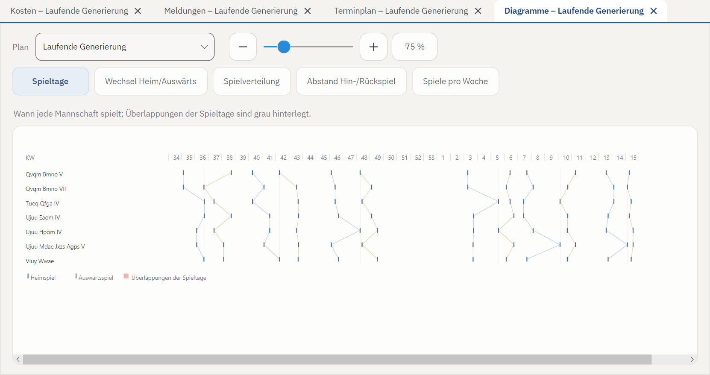

**Wechsel Heim/Auswärts** – die Folge der Heim- und Auswärtsspiele je Mannschaft. Ideal ist ein Zickzack: auf ein Heimspiel folgt ein Auswärtsspiel. Waagerechte Stücke sind Serien von Heim- oder Auswärtsspielen. Ganz ohne Serien geht es selbst bei idealen Meldungen nicht.

**Spielverteilung** – die Termine jeder Mannschaft über die Saison. Hier sieht man, ob die Spiele gleichmäßig verteilt sind oder ob sich Spiele ballen und dazwischen lange Pausen liegen. Kleine Quadrate markieren Koppeltermine.

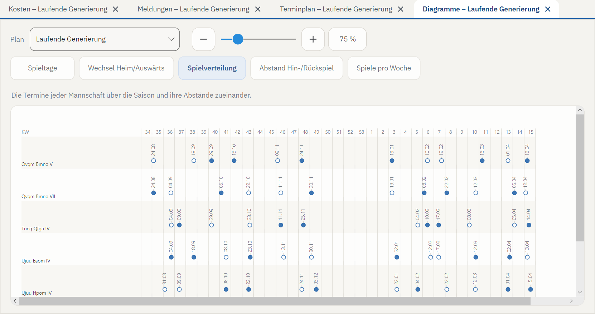

**Abstand Hin-/Rückspiel** – wie weit Heim- und Auswärtsspiel gegen denselben Gegner auseinanderliegen. Ungünstige Konstellationen, etwa Hin- und Rückspiel kurz hintereinander, sind rot markiert.

**Spiele pro Woche** – wie viele Spiele jede Mannschaft je Woche hat, und nach dem Schrägstrich, wie viele sie bis dahin insgesamt gespielt hat. Die letzte Zeile nennt die größte Differenz zwischen den Mannschaften am Ende der Woche: Hat nach der dritten Woche eine Mannschaft drei Spiele gemacht und eine andere keines, steht dort 3.

**Setzliste** (nur mit aktiver Setzliste) – für jedes Spiel als Balken, wie weit die beiden Gegner in der Setzliste auseinanderliegen. Mannschaften, die nah beieinander gesetzt sind, sollen erst gegen Ende gegeneinander spielen – Erster gegen Zweiten möglichst am letzten Spieltag. Ideal liegen alle Balken unter der grauen Linie. Überbewerten sollte man das nicht: Die Setzliste ist nur eine Vermutung, und Sperrtermine oder enge Spielfolgen sind den Mannschaften meist wichtiger.

### 6.6 Terminwünsche

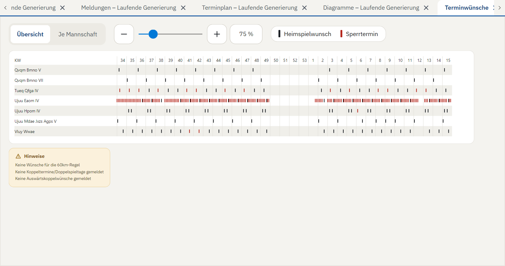

Die Ansicht zeigt, was die Vereine gemeldet haben, auf zwei Seiten (Umschalter oben):

- **Übersicht:** ein Raster aller Heimspielwünsche (dunkle Striche), Koppeltermine (blau) und Sperrtermine (rot) über die ganze Saison, darunter allgemeine Hinweise zur Staffel.
- **Je Mannschaft:** eine Karte pro Mannschaft mit ihren Wünschen, Koppelpartnern, Spiellokal, Hallenbelegung durch Nachbarn, Sperrterminen, Auswärtskoppeln, 60-km-Regel, Heimrecht und der Auswertung, ob die gemeldeten Termine ausreichen. Karten mit Problemen stehen vorn.

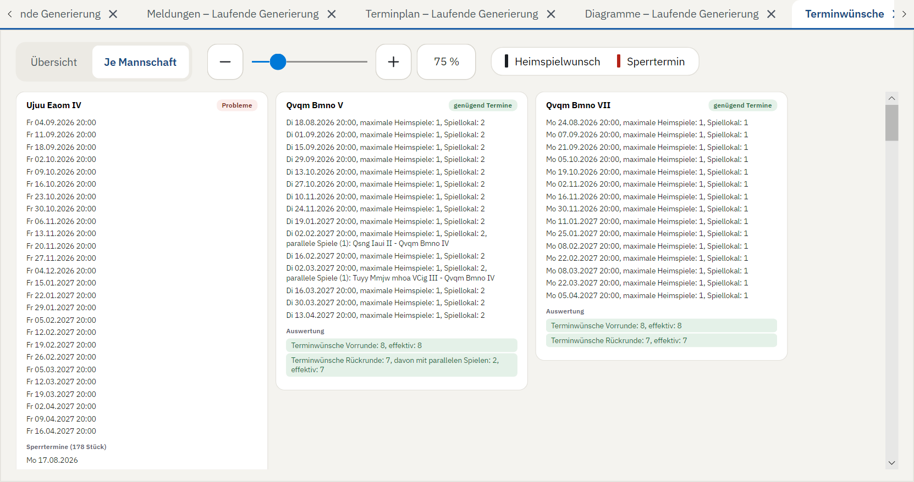

Hat eine Mannschaft zu wenige Termine gemeldet, bleiben einzelne Spiele ohne Termin. Beim Export werden sie auf den ersten Tag der Runde um 00:00 Uhr gesetzt und müssen in click-TT von Hand terminiert werden.

### 6.7 Nachbarmannschaften

Die Ansicht zeigt die Spiele aus anderen Staffeln, die mit der XML-Datei eingelesen wurden: je Tag, welche Nachbar- und Vereinsmannschaften spielen. Sie dient zur Kontrolle, was click-TT übertragen hat und welche Staffeln dort schon terminiert sind. Direkte Nachbarmannschaften sind anders markiert als weitere Vereinsmannschaften.

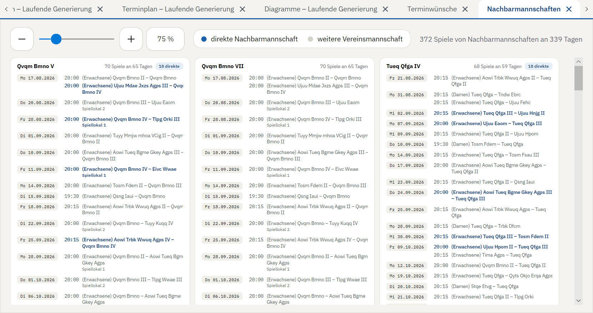

## 7. Gewichtungen anpassen

Die Gewichtungen legen fest, wie wichtig Ihnen die einzelnen Kostenarten sind. Es kommt nicht auf die Höhe der Kosten an, sondern auf ihr **Verhältnis** zueinander: Ist ein belegter Sperrtermin schlimmer als ein paralleles Spiel? Sind überlappende Spieltage wichtiger als ein Wechsel von Heim- und Auswärtsspielen? Die Standardgewichtung ist ein erprobter Mittelweg; jede Staffel ist aber anders.

Es gibt sieben Stufen: **Nicht berücksichtigen, sehr wenig, wenig, normal, hoch, sehr hoch, extrem hoch.**

Gewichten lässt sich auf drei Ebenen, die sich addieren:

1. **eine Kostenart für alle Mannschaften** – z. B. Sperrtermine *hoch*;
2. **alle Kosten einer Mannschaft** – z. B. eine Mannschaft, deren Wünsche besonders wichtig sind;
3. **eine Kostenart bei einer einzelnen Mannschaft** – z. B. die Sperrtermine nur dieser einen Mannschaft.

*Nicht berücksichtigen* auf irgendeiner Ebene schaltet die Kosten ganz ab.

**In der Kostenansicht:** Klicken Sie auf einen Spaltenkopf (Ebene 1), einen Mannschaftsnamen (Ebene 2) oder eine Zelle (Ebene 3). Im Detailfeld rechts wählen Sie die Stufe (*Nicht berücksichtigen* heißt dort kurz **aus**); die Änderung gilt sofort und wird gespeichert. Aus einer Zelle heraus springen **Kostenart für alle …** und **Ganze Mannschaft …** zur übergeordneten Ebene.

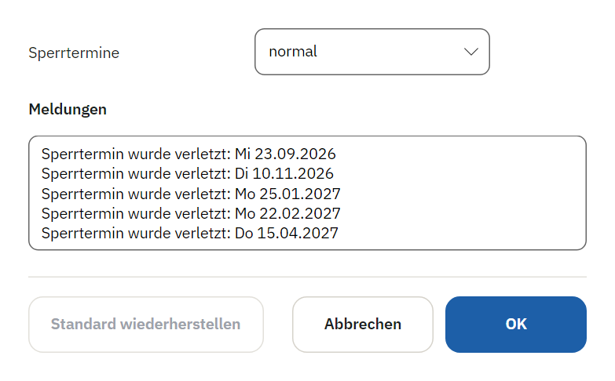

**In den Einstellungen** (links unter *Staffel*) finden Sie alle Gewichtungen auf einer Seite: die allgemeinen Plankosten, die Mannschaftskosten und die Gewichtung je Mannschaft. Auch hier gilt jede Änderung sofort. **Standard wiederherstellen …** setzt alles auf die Ausgangswerte zurück.

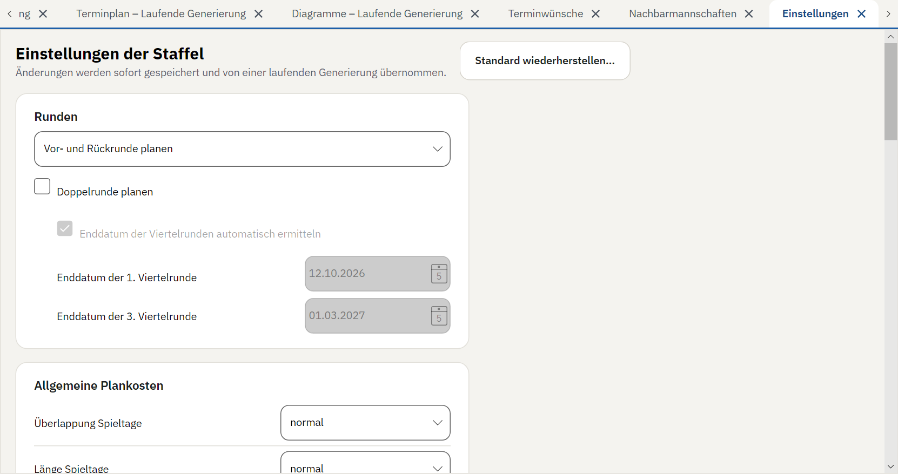

**So gehen Sie am besten vor**

- Ändern Sie immer nur **eine** Gewichtung und geben Sie dem Programm dann etwas Zeit, einen Plan für die neue Gewichtung zu finden.
- Jede Erhöhung hat ihren Preis: Was wichtiger wird, drängt alles andere zurück.
- Koppeltermine verschlechtern fast immer die übrigen Kriterien. Sollen möglichst viele erfüllt werden, müssen **Heimkoppel** und **Auswärtskoppel** meist höher gewichtet werden.
- Nach einer Änderung vergleicht die Kachel *Gesamtkosten* die Verbesserung ab dieser Änderung – die Kosten davor sind mit anderen Gewichten gerechnet und nicht vergleichbar.

## 8. Pläne merken und vergleichen

Um Pläne aus verschiedenen Einstellungen zu vergleichen, merken Sie sich Zwischenstände:

1. **Plan merken** (oben) anklicken – gemerkt wird der beste Plan der laufenden Generierung.
2. Einen Namen eingeben, z. B. „Sperrtermine hoch“.

Der Plan erscheint danach in jeder Ansicht in der Auswahl **Plan** und unter **Start mit**. Sie können ihn so ansehen, mit dem aktuellen vergleichen, als Ausgangsplan für eine neue Generierung nehmen oder entfernen: Ist er vor dem Start unter **Start mit** gewählt, steht oben an der Stelle von *Plan merken* der Knopf **Plan löschen**.

Gemerkte Pläne liegen im Datenordner der Staffel und stehen auch nach einem Neustart zur Verfügung.

## 9. Export und Druck

### 9.1 Für click-TT exportieren

**Für click-TT exportieren** (linke Leiste, *Ausgabe*, farblich hervorgehoben) speichert den **gerade angezeigten Plan** als CSV-Datei, die click-TT als Spielplan importiert: den Plan, den die aktive Ansicht zeigt (laufende Generierung, click-TT-Plan oder ein gemerkter Plan), sonst den Stand der Generierung bzw. den unter *Start mit* gewählten Plan. Welcher es ist, verrät der Tooltip. Gibt es keinen Plan, ist der Eintrag grau und nicht anklickbar. Exportieren Sie den laufenden Plan, pausieren Sie die Generierung vorher, damit er sich nicht mehr ändert.

Vor dem Export prüft das Programm auf harte Fehler: Spiele ohne Termin, Spiele mit ungültigem Termin und Spiele an spielfreien Tagen. Gibt es welche, werden sie aufgelistet, und Sie entscheiden, ob Sie trotzdem exportieren. Spiele ohne Termin stehen in der CSV-Datei am ersten Tag der Runde um 00:00 Uhr.

Die Spiellokale werden mit exportiert. Sie müssen dafür Nummern von 1 bis 5 sein, so wie click-TT sie erwartet.

Wurde nur die Vor- oder nur die Rückrunde geplant, enthält die CSV-Datei auch nur deren Spiele.

### 9.2 Drucken (PDF)

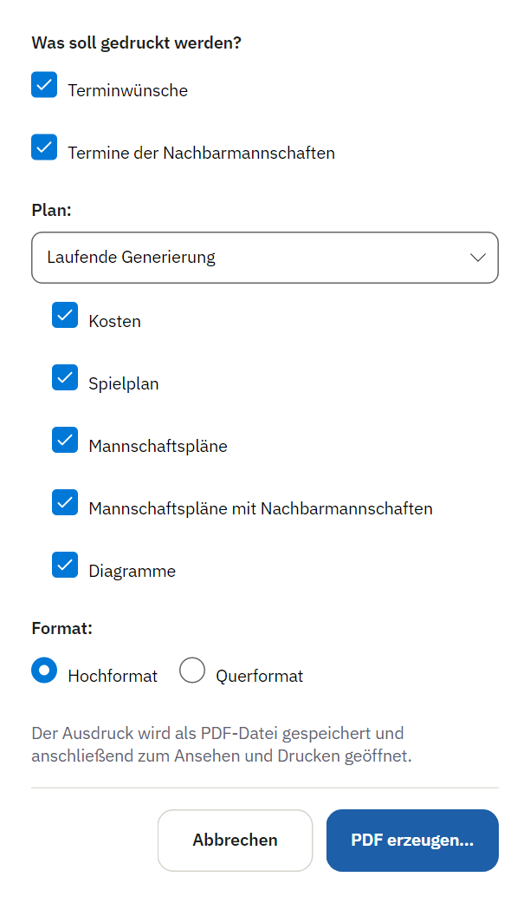

**Drucken (PDF)** erzeugt einen Ausdruck als PDF-Datei und öffnet ihn anschließend zum Ansehen und Drucken. Im Dialog wählen Sie:

- **welcher Plan** gedruckt wird,
- **was** gedruckt wird: Terminwünsche, Termine der Nachbarmannschaften, Kosten, Spielplan, Mannschaftspläne, Mannschaftspläne mit Nachbarmannschaften, Diagramme,
- **Hoch- oder Querformat**.

Jeder Abschnitt beginnt auf einer neuen Seite; zu breite Tabellen und Diagramme werden passend verkleinert. Solange es noch keinen Plan gibt, lassen sich nur Terminwünsche und Termine der Nachbarmannschaften drucken.

## 10. Spielplandaten bearbeiten

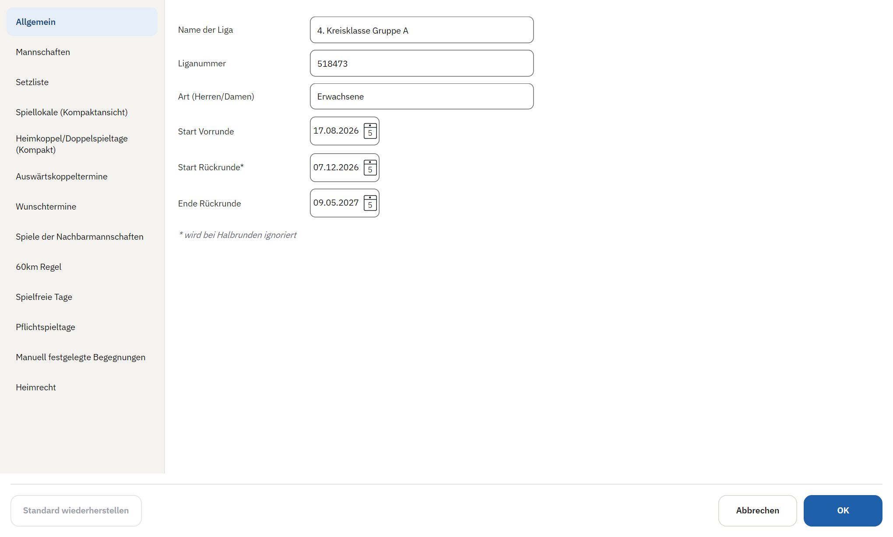

Unter **Spielplandaten** lassen sich alle Daten ändern, die click-TT geliefert hat. Links wählen Sie die Seite, bei Seiten je Mannschaft daneben die Mannschaft. Mit **OK** werden die Änderungen übernommen und in der `.modifications`-Datei neben der XML-Datei gespeichert; **Abbrechen** verwirft sie. Eine laufende Generierung übernimmt die Änderungen sofort.

Weil die Änderungen getrennt von der XML-Datei gespeichert werden, können Sie die XML-Datei jederzeit neu aus click-TT herunterladen: Speichern Sie sie unter demselben Namen, bleiben Ihre Änderungen erhalten.

### Allgemein

Die Stammdaten der Liga: Name, Liganummer, Art (Herren, Damen …) sowie Start der Vorrunde, Start der Rückrunde und Ende der Rückrunde. Die Art ist wichtig, um die Nachbarmannschaften richtig zu bestimmen. Der Start der Rückrunde wird bei Halbrunden nicht verwendet.

### Mannschaften

Mannschaften anlegen, bearbeiten und löschen. Über die **Vereins-ID** erkennt das Programm, welche Mannschaften zu einem Verein gehören; über die **Mannschaftsnummer** (1., 2., 3. Mannschaft …) die echten Nachbarmannschaften. Ein Spiellokal tragen Sie nur ein, wenn der Verein in mehreren Hallen spielt.

### Setzliste

Mit der Setzliste geben Sie die erwartete Abschlusstabelle vor. Ziel ist, dass die Spiele, in denen es um Auf- und Abstieg geht, am Ende der Saison stattfinden – und nicht Mannschaften beteiligt sind, für die es um nichts mehr geht. So bleibt die Spannung bis zum Schluss.

Ordnen Sie die Mannschaften per Ziehen oder mit **Nach oben** / **Nach unten**. Mit **Setzliste aktivieren** schalten Sie sie ein oder aus.

### Spiellokale (Kompaktansicht)

click-TT überträgt keine Spiellokale. Meist ist das egal, weil die Vereine nur eine Halle haben. Stehen mehrere Hallen zur Verfügung, braucht das Programm die Spiellokale, damit die maximale Zahl gleichzeitiger Heimspiele je Halle eingehalten wird.

Je Mannschaft tragen Sie das **Standardspiellokal** ein und darunter, falls nötig, abweichende Spiellokale für einzelne Heimspieltage. Die Tabelle **Spiellokale der Nachbarmannschaften** enthält das Standardspiellokal jeder Nachbarmannschaft; spielt eine Nachbarmannschaft nur bei einzelnen Spielen woanders, öffnet ein Doppelklick auf ihren Namen die Bearbeitung.

### Heimkoppel/Doppelspieltage (Kompakt)

Vor allem in höheren Ligen möchten Mannschaften an einem Wochenende zwei Spiele bestreiten. Die Meldungen dazu sind kompliziert und nicht immer eindeutig; das Programm leitet ab, was vermutlich gemeint ist. **Bitte immer kontrollieren.**

- **Heimkoppel:** zwei Heimspiele an einem Tag. click-TT erlaubt je Tag nur eine Uhrzeit; das Programm legt deshalb automatisch einen zweiten Termin vier Stunden davor oder danach an. Die tatsächliche Uhrzeit des zweiten Spiels tragen Sie später in click-TT nach.
- **Doppelspieltag:** zwei Heimspiele an zwei aufeinanderfolgenden Tagen, meist Samstag und Sonntag. Möglich ist das, wenn die Mannschaft an beiden Tagen einen Wunschtermin hat. Je Terminpaar legen Sie fest, ob der Doppelspieltag gewünscht, möglich oder nicht gewünscht ist; vorbelegt ist, was die Mannschaft in click-TT angegeben hat.

Diese Seite fasst die Koppeloptionen aller Wunschtermine zusammen. Neue Koppeltermine und die zweite Anfangszeit legen Sie in den **Wunschterminen** an.

### Auswärtskoppeltermine

Hier geben Mannschaften an, bei welchen zwei Gegnern sie an einem Wochenende auswärts spielen möchten – meist, um eine lange Anfahrt nur einmal zu machen. Je Wunsch legen Sie fest, ob beide Spiele an **einem Tag**, an **zwei Tagen** (mit Übernachtung) oder wahlweise stattfinden sollen. Für einen Gegner sind auch mehrere Wünsche möglich.

Sollen beide Spiele an einem Tag stattfinden, braucht es genug Abstand zwischen den Anfangszeiten. Meist spielen die Mannschaften aber zu festen Zeiten; das Programm darf deshalb bei einer der beteiligten Heimmannschaften die Anfangszeit verschieben. Unter **Alternative Anfangszeiten** legen Sie fest, an welchen Terminen welcher Mannschaft das erlaubt ist. Die genaue zweite Uhrzeit steht im jeweiligen Wunschtermin.

### Wunschtermine

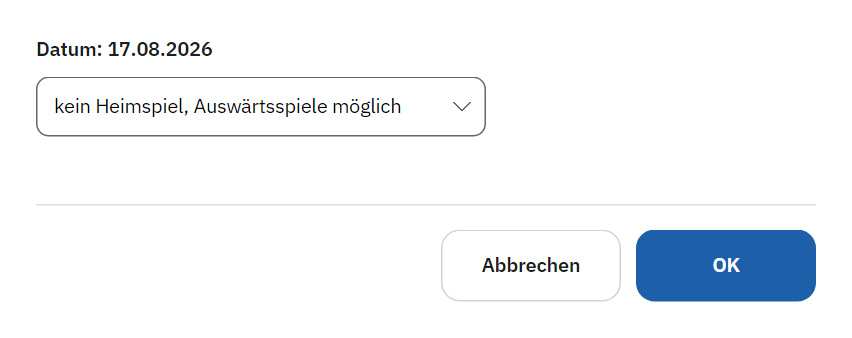

Je Mannschaft alle Tage der Saison, wochenweise:

- eine **Uhrzeit** (z. B. `18:00`): an diesem Tag ist ein Heimspiel möglich;
- **FREI**: Sperrtermin, die Mannschaft möchte an diesem Tag nicht spielen;
- **leer**: an diesem Tag ist ein Auswärtsspiel möglich.

Ein **Doppelklick** auf einen Heimspieltermin – oder die **rechte Maustaste** und dann **Bearbeiten …** – öffnet seine weiteren Optionen:

| Option | Bedeutung |
|---|---|
| **Ausweichtermin** | Nur im Notfall einplanen (Kostenart *Ausweichtermine*). |
| **Maximale Heimspiele** | So viele Mannschaften können gleichzeitig in dieser Halle spielen (Kostenart *Hallenbelegung*). |
| **Spiellokal** | Abweichend vom Standardspiellokal der Mannschaft. |
| **Koppel/Doppelspieltag** | Zwei Spiele an einem Tag bzw. an zwei aufeinanderfolgenden Tagen. Für einen Doppelspieltag muss auch der Folgetag als Doppelspieltag gekennzeichnet sein. |
| **Priorität bei Koppel** | Wie dringend der Koppeltermin eingeplant werden soll (wirkt auf die Kostenart *Heimkoppel*). |
| **Startzeit zweites Spiel** | Die zweite Anfangszeit bei einem Koppeltermin an einem Tag. |
| **Auswärtskoppel** | Eine mögliche andere Anfangszeit, damit Auswärtskoppeltermine an einem Tag möglich werden. |

### Spiele der Nachbarmannschaften

Die Spiele der Nachbarmannschaften braucht das Programm für die Hallenbelegung und damit benachbarte Mannschaften nicht zu oft am selben Tag spielen. Hier legen Sie Nachbarmannschaften an, bearbeiten oder löschen sie. Je Nachbarmannschaft lässt sich einstellen:

- **Gleichzeitige (parallele) Spiele mit dieser Mannschaft vermeiden** – zum Beispiel, weil dieselben Spieler aushelfen;
- **Gleichzeitige (parallele) Heimspiele mit dieser Mannschaft sind erwünscht** – zum Beispiel, wenn ein Verein für die Wochenenden eigens eine Halle anmietet und möglichst wenige Hallentage haben möchte;

dazu die einzelnen **Begegnungen** dieser Mannschaft.

### 60km Regel

Ist die Anfahrt zu einem Gegner zu weit, sollen die Spiele gegen ihn am Wochenende stattfinden. Hier legen Sie fest, für welche Paarungen das gilt. Ob der Freitag zum Wochenende zählt, stellen Sie in den **Einstellungen** ein.

### Spielfreie Tage

An einzelnen Tagen soll gar nicht gespielt werden – etwa weil die Relegationstermine noch nicht feststanden, weil nachträglich ein Spielverbot beschlossen wurde oder weil beim Anlegen der Spieltage ein Fehler passiert ist. Diese Tage tragen Sie hier ein. Die Auswertung der Terminwünsche berücksichtigt sie.

### Pflichtspieltage

Hier legen Sie fest, wie viele Spiele jede Mannschaft in einem Zeitraum mindestens machen muss – etwa mindestens ein Spiel zwischen dem 14. und 18. April oder mindestens drei Spiele im November.

Setzen Sie Pflichtspieltage sparsam ein: Sie nehmen dem Programm Freiheit und verschlechtern den Plan meist. Sinnvoll sind sie vor allem für einen gemeinsamen letzten Spieltag, falls das Programm ihn nicht ohnehin so plant. Bei **ungerader Mannschaftszahl** muss am Pflichtspieltag zwangsläufig eine Mannschaft pausieren und bekäme sonst in einer Woche zwei Spiele. Verlängern Sie dann den Zeitraum, oder löschen Sie die Pflichtspieltage und lassen Sie das Programm den letzten Spieltag über die Kosten optimieren.

### Manuell festgelegte Begegnungen

Stehen Spiele schon vor der Planung fest – etwa weil zwei befreundete Vereine immer am Tag des Weinfests gegeneinander spielen –, tragen Sie sie hier mit Datum, Uhrzeit und Spiellokal ein. Der Plan wird um diese Spiele herum erstellt.

### Heimrecht

Manchmal soll die Zahl der Heimspiele in Vor- und Rückrunde nicht gleich sein, oder das Heimrecht gegen bestimmte Gegner soll in einer bestimmten Runde liegen – etwa weil eine Halle saniert wird oder weil Jugendligen zur Rückrunde neu zusammengestellt werden. Hier geben Sie je Mannschaft die Anzahl der Heimspiele und das Heimrecht gegen einzelne Gegner vor.

Zu beachten:

- Soll eine Mannschaft in einer Runde nur Heim- oder nur Auswärtsspiele haben, steigen ihre Kosten für den Wechsel von Heim- und Auswärtsspielen stark an. Stellen Sie *Wechsel H/A* für diese Mannschaft dann auf **Nicht berücksichtigen**.
- Ob die Vorgaben überhaupt erfüllbar sind, prüft das Programm nicht. Es ließe sich zum Beispiel eingeben, dass sowohl A gegen B als auch B gegen A das Heimrecht in der Vorrunde hat.

## 11. Runden

Die Art der Runde stellen Sie in den **Einstellungen** unter **Runden** ein. Beim Öffnen schlägt das Programm eine passende Einstellung vor (siehe [Staffel einrichten](#33-die-staffel-einrichten)).

**Vor- und Rückrunde planen** ist der Normalfall und liefert die besten Ergebnisse.

**Halbrunde planen:** Manche Jugendligen spielen zwei Halbrunden statt Vor- und Rückrunde. In diesem Fall wird zwischen zwei Mannschaften nur ein Spiel geplant.

**Nur Vorrunde / Nur Rückrunde planen:** In manchen Verbänden werden die Runden einzeln geplant, weil Vereine ihre Hallenzeiten für die Rückrunde noch nicht kennen. Nutzen Sie das nur aus diesem Grund – gemeinsam geplant werden die Pläne besser. Wird nur die Rückrunde geplant, berücksichtigt das Programm die in click-TT vorhandenen Spiele der Vorrunde. Auch der Export enthält dann nur die geplante Runde.

**Doppelrunde planen:** Jede Mannschaft spielt viermal gegen jede andere, in zwei Vor- und zwei Rückrunden (Viertelrunden). Das Programm ermittelt aus den Wunschterminen, wann die erste und die dritte Viertelrunde enden sollten. Passt das nicht, schalten Sie **Enddatum der Viertelrunden automatisch ermitteln** aus und tragen die Daten selbst ein.

**Coronarunde planen:** Plant nur die noch nicht gespielten Spiele der Rückrunde. Die Einstellung stammt aus der Saison 2020/21 und ist für Sonderfälle erhalten geblieben.

## 12. Bewertung der Pläne (Kosten)

Das Programm vergibt für ungünstige Konstellationen **Kosten**, etwa für einen belegten Sperrtermin. Gesucht wird der Plan mit den geringsten Gesamtkosten. Die absolute Höhe spielt keine Rolle, nur das Verhältnis der Kostenarten zueinander – und das bestimmen Sie über die Gewichtungen (Abschnitt [7](#7-gewichtungen-anpassen)).

Damit die Nachteile halbwegs gerecht verteilt werden, steigen die Kosten je Mannschaft in der Regel **quadratisch** mit der Zahl der Verstöße: Kostet ein Verstoß 100 Punkte, kosten zwei bei derselben Mannschaft 400. Zwei Verstöße bei einer Mannschaft wiegen also schwerer als je einer bei zwei Mannschaften.

In der Standardgewichtung haben die Kostenarten schon ein sinnvolles Verhältnis; eine belegte Halle zählt zum Beispiel mehr als ein paralleles Spiel.

### Kosten des ganzen Plans

**Überlappung Spieltage** – Eine Mannschaft hat zu einem Zeitpunkt schon mehr als ein Spiel mehr absolviert als eine andere. Im Diagramm *Spieltage* sind diese Überlappungen grau hinterlegt.

**Länge Spieltage** – Ein Spieltag soll sich über möglichst wenige Tage erstrecken.

**Überlappung letzter Spieltag** und **Länge letzter Spieltag** – dasselbe, nur für den letzten Spieltag. Er soll möglichst kurz sein und so liegen, dass alle Mannschaften zuletzt nur noch ein Spiel haben.

**Vereinsinterne Spiele am Anfang** – Mannschaften desselben Vereins sollen zu Beginn jeder Halbrunde gegeneinander spielen.

### Kosten je Mannschaft

**Hallenbelegung** – Die maximale Zahl gleichzeitiger Heimspiele in einer Halle ist überschritten.

**parallele Spiele** – Eine Nachbarmannschaft spielt am selben Tag. Nachbarmannschaft ist nur die direkt höhere oder niedrigere Mannschaft des Vereins: Für die 2. Herren zählen also die 1. und die 3. Herren. Die 4. zählt nur, wenn auch die 3. spielt. Sollen weitere Mannschaften nicht parallel spielen – etwa Bambini und 3. Jugend –, tragen Sie das bei den *Spielen der Nachbarmannschaften* ein.

**synchrone Heimspiele** – Ist bei einer Nachbarmannschaft eingestellt, dass gemeinsame Heimspiele erwünscht sind, versucht das Programm, die Heimspiele beider Mannschaften auf dieselben Tage zu legen. Die Kosten entstehen, wenn das nicht gelingt.

**Sperrtermine** – An einem Sperrtermin wird gespielt. Das Programm behandelt Sperrtermine als Wunsch, nicht als absolutes Verbot: Je mehr Sperrtermine eine Mannschaft meldet, desto weniger zählt der einzelne. Wer einen ganzen Monat sperrt, muss damit rechnen, dass nicht alle eingehalten werden; wer nur die drei Tage des örtlichen Altstadtfests sperrt, kann sich ziemlich sicher sein.

**Ausweichtermine** – Ein Ausweichtermin wurde verplant. Besser ist ein Plan, der ohne auskommt.

**60km Regel** – Ein Spiel, das wegen der weiten Anfahrt am Wochenende stattfinden soll, liegt unter der Woche. Ob der Freitag zum Wochenende zählt, legen Sie in den Einstellungen fest.

**3-Tage-Abstand** – Zwischen zwei Spielen einer Mannschaft liegen weniger als drei Tage; bei nur einem Tag entsprechend teurer.

**2-Spiele-die-Woche** – Eine Mannschaft hat zwei oder mehr Spiele in einer Woche. Koppeltermine sind ausgenommen.

**Spielverteilung** – Die Abstände zwischen den Spielen einer Mannschaft sollen ähnlich sein. Dabei zählen die gemeldeten Wunschtermine im Zeitraum: Bei vielen möglichen Terminen soll der Abstand kürzer sein, bei wenigen länger. Ferien gelten so nicht als Spielpause. Bei großen Staffeln ergibt sich eine gute Verteilung meist von allein; wichtig ist die Kostenart vor allem bei Staffeln mit wenigen Mannschaften.

**Heimkoppel** – Ein gewünschter Heimkoppeltermin oder Doppelspieltag wurde nicht eingeplant. Je Halbrunde wird höchstens ein Viertel der Staffelgröße als Koppeltermin vergeben: In einer Zehnerstaffel hat eine Mannschaft vier bis fünf Heimspiele je Halbrunde, möglich sind also zwei Koppeltermine.

**Auswärtskoppel** – Ein Auswärtskoppelwunsch wurde nicht erfüllt. Je mehr solcher Wünsche eine Mannschaft meldet, desto weniger zählt der einzelne.

**Ungleich H/A** – Die Zahl der Heimspiele in Vor- und Rückrunde ist verschieden bzw. weicht von den Vorgaben beim *Heimrecht* ab.

**Wechsel H/A** – Auf ein Heimspiel soll ein Auswärtsspiel folgen und umgekehrt. Siehe Diagramm *Wechsel Heim/Auswärts*.

**Abstand H/A** – Die Rückrunde soll die Gegner in ähnlicher Reihenfolge bringen wie die Vorrunde: Wer das letzte Vorrundenspiel gegen B hat, soll die Rückrunde nicht wieder mit B beginnen. Siehe Diagramm *Abstand Hin-/Rückspiel*.

**Setzliste** – Nah beieinander gesetzte Mannschaften treffen zu früh aufeinander.

**Pflichtspieltage** – Eine Mannschaft erreicht in einem vorgegebenen Zeitraum nicht die geforderte Zahl von Spielen.

### Harte Fehler

Spiele ohne Termin, Spiele mit ungültigem Termin und Spiele an spielfreien Tagen gelten als harte Fehler und kosten je 10 Milliarden. Ein Plan mit harten Fehlern ist deshalb immer schlechter als jeder Plan ohne. In den ersten Sekunden einer Generierung sind sie normal; bleiben sie bestehen, fehlen meist Termine (siehe [Terminwünsche](#66-terminwünsche)).

## 13. Tipps und häufige Fragen

**Wie erkenne ich Spiele ohne Termin?**
In der Qualitätsansicht unter A1, an sehr hohen Gesamtkosten und im Terminplan: Spiele ohne Termin stehen dort immer ganz oben.

**Kann eine Mannschaft zwei Spiele gleichzeitig haben?**
Nein, das wäre ein Programmfehler. Pokalspiele überträgt click-TT allerdings nicht; Überschneidungen mit Pokalspielen kann das Programm deshalb nicht verhindern. Pokalspiele werden aber üblicherweise später angesetzt.

**Das Programm findet keine Verbesserung mehr.**
Das Programm verbessert den Plan durch viele kleine Tauschaktionen. Manchmal müsste es aber viele Spiele auf einmal tauschen, um weiterzukommen, und scheint sich im aktuellen Plan „festgebissen“ zu haben. Dann hilft ein Umweg:

1. Den aktuellen Plan **merken** – vielleicht war er doch der bessere.
2. Die störende Kostenart vorübergehend auf **sehr hoch** oder **extrem hoch** setzen und warten, bis sie deutlich gesunken ist. Der Plan ist dann in anderer Hinsicht wahrscheinlich schlechter.
3. Die Gewichtung schrittweise zurücknehmen und die übrigen nachjustieren, bis wieder ein ausgewogener Plan entsteht.

So geben Sie dem Programm einen Wink, in welcher Richtung es suchen soll. Übrigens macht das Programm selbst Ähnliches: Nach einiger Zeit rechnet eine eigene Suchgruppe mit einer extrem gewichteten Kostenart und bietet ihre Ergebnisse den anderen an.

**Kann ich mehrere Staffeln gleichzeitig planen?**
Nein. Das Programm berücksichtigt die Spiele der anderen Staffeln – aber nur die, die beim Herunterladen der XML-Datei schon in click-TT standen. Planen Sie die Staffeln deshalb nacheinander: Staffel planen, in click-TT importieren, dann die XML-Datei der nächsten Staffel herunterladen.

**Hallenbelegung und parallele Spiele außerhalb des BTTV**
Im Bayerischen TTV werden Hallenbelegung und Spiele der Nachbarmannschaften bei der Planung berücksichtigt, in anderen Verbänden traditionell nicht. Die Angabe der maximalen Heimspiele ist in click-TT zwar überall möglich, wird außerhalb des BTTV aber oft ohne Bedeutung ausgefüllt und taugt dann nicht für die Berechnung. Korrigieren Sie die Werte in den Wunschterminen oder stellen Sie *Hallenbelegung* und *parallele Spiele* in den Einstellungen auf **Nicht berücksichtigen**.

**Wird mein Rechner während der Generierung langsam?**
Das Programm lässt einen Prozessorkern frei und rechnet mit niedriger Priorität, damit andere Programme bedienbar bleiben. Wer den Rechner in Ruhe lassen möchte, pausiert die Generierung.

---

*AndiGenerator.NET – Portierung des AndiGenerators von Andreas Hofmann. Freie Software unter der GNU General Public License Version 3.*
