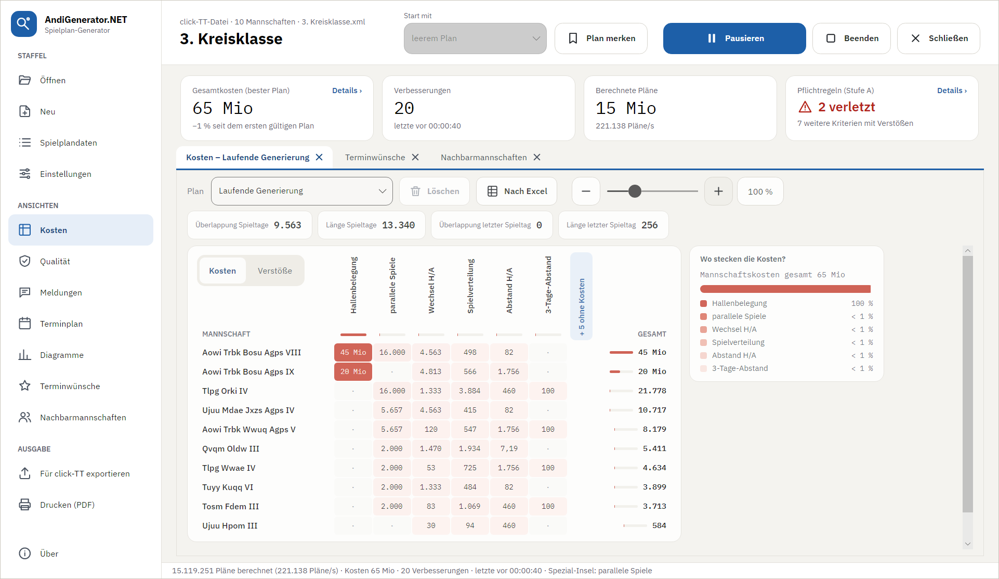

# AndiGenerator.NET

[](https://github.com/PBuchmann/AndiGenerator.NET/actions/workflows/ci.yml)
[](LICENSE)

**Spielpläne für Tischtennis-Staffeln – aus den Terminwünschen in click-TT.**

AndiGenerator.NET liest die Terminmeldungen einer Staffel aus click-TT, sucht mit allen Prozessorkernen nach dem Spielplan, der die Wünsche der Vereine am besten erfüllt, und exportiert das Ergebnis als CSV-Datei für den Import in click-TT. Während der Suche zeigt das Programm laufend, wo der beste Plan noch Kosten verursacht; über Gewichtungen steuern Sie, was Ihnen wichtig ist.



## Herkunft

AndiGenerator.NET ist die C#/.NET-Portierung des **AndiGenerators** von **Andreas Hofmann**, mit dem Staffelleiter seit 2017 ihre Spielpläne erstellen. Seine Optimierung mit Inseln, die Kostenfunktion, der click-TT-Import, die Auswertung von Terminwünschen und Nachbarmannschaften, die Diagramme und die Dateiformate sind übernommen und rechnen genauso: Die Kosten stimmen in allen Referenzfällen mit dem Original überein. Neu sind die Oberfläche, die Bedienung und die Umsetzung in .NET. Mehr dazu in [Doku/ENTSTEHUNG.md](Doku/ENTSTEHUNG.md).

## Funktionen

- click-TT-Export (XML) öffnen; Änderungen an den Daten bleiben getrennt davon in einer `.modifications`-Datei erhalten – kompatibel mit dem Original
- Einrichtung nach dem Öffnen: alle Rückfragen (Spiellokale, Koppeltermine, Setzliste, Pflichtspieltage …) auf einer Seite
- Generierung auf allen Kernen, laufend übernommene Gewichtungen, Pläne merken und vergleichen
- Ansichten: Kostenmatrix, Qualität (Pflichtregeln), Meldungen, Terminplan, Diagramme, Terminwünsche, Nachbarmannschaften
- Ausgabe: CSV für click-TT, Excel-Arbeitsmappe, Ausdruck als PDF
- Vor- und Rückrunde, Halbrunde, Doppelrunde, einzelne Runden

## Anleitung

- [Anleitung lesen](Doku/ANLEITUNG.md) (auch als [PDF](Doku/Anleitung.pdf), im Programm unter **Anleitung**)

## Installation

Die neueste Version gibt es unter [Releases](https://github.com/PBuchmann/AndiGenerator.NET/releases): `AndiGeneratorNET-win-Setup.exe` installiert das Programm für den eigenen Benutzer (ohne Administratorrechte) und hält es danach selbst aktuell; `AndiGeneratorNET-win-Portable.zip` läuft ohne Installation. Windows 10/11, 64 Bit. Bis zur digitalen Signierung warnt Windows beim ersten Start – Einzelheiten in der [Anleitung](Doku/ANLEITUNG.md#2-installation).

## Selbst bauen

Voraussetzung ist das [.NET 10 SDK](https://dotnet.microsoft.com/download/dotnet/10.0).

```sh
dotnet build AndiGenerator.slnx -c Release
dotnet test AndiGenerator.slnx -c Release --no-build
dotnet run --project src/AndiGenerator.Desktop -c Release --no-build
```

Unter Windows erledigen `bauen.cmd` (bauen und testen) und `starten.cmd` dasselbe. Warnungen – auch die von StyleCop und SonarAnalyzer – gelten als Fehler. Die Build-Ausgaben liegen außerhalb des Quellordners unter `%LOCALAPPDATA%\AndiGenerator.NET\artifacts`.

**Aufbau** (Schichten, jede kennt nur die darunter):

| Projekt | Inhalt |
|---|---|
| `AndiGenerator.Domain` | Fachmodell: Staffel, Mannschaften, Termine, Optionen |
| `AndiGenerator.Engine` | Bewertung (Kostenfunktion) und Optimierung: Referenzmodell, schnelle Engine, Inselmodell |
| `AndiGenerator.Persistence` | click-TT-Import, `.modifications`, Optionen, gemerkte Pläne, CSV und Excel |
| `AndiGenerator.Application` | Ablauf einer Sitzung, Optimierungsdienst, Datenbearbeitung |
| `AndiGenerator.Rendering` | Diagramme, Terminwunschraster und Ausdruck – für Bildschirm und PDF |
| `AndiGenerator.Presentation` | ViewModels (MVVM, ohne Oberflächenbibliothek) |
| `AndiGenerator.UI`, `AndiGenerator.Desktop` | Oberfläche mit Avalonia und Dock.Avalonia, Programmstart |
| `tools/AndiGenerator.Cli` | Kommandozeile zum Optimieren und Messen |

Die Tests laufen gegen die anonymisierten Testdaten in `testdaten/` (Vereinsnamen durch Kunstnamen ersetzt, siehe [Doku/TESTDATEN.md](Doku/TESTDATEN.md)). Planung, Entscheidungen und Stand der Portierung stehen in [Doku/MIGRATIONSPLAN.md](Doku/MIGRATIONSPLAN.md).

## Mitwirken

Beiträge sind willkommen – Ablauf über Branches und Pull Requests, Code-Stil und Umgang mit Testdaten stehen in [CONTRIBUTING.md](CONTRIBUTING.md). Sicherheitslücken bitte vertraulich melden, siehe [SECURITY.md](SECURITY.md). Wie Releases gebaut und signiert werden, steht in [CODE_SIGNING.md](CODE_SIGNING.md).

## Lizenz

AndiGenerator.NET ist Freie Software unter der [GNU General Public License Version 3](LICENSE) (`GPL-3.0-only`), wie das Original.

- Original *AndiGenerator*: Copyright © 2017 ff. Andreas Hofmann
- C#-Portierung und neue Oberfläche: Copyright © 2026 Peter Buchmann

Einzelheiten in [LIZENZ.md](LIZENZ.md), verwendete Bibliotheken und Schriften in [THIRD-PARTY-NOTICES.md](THIRD-PARTY-NOTICES.md).
